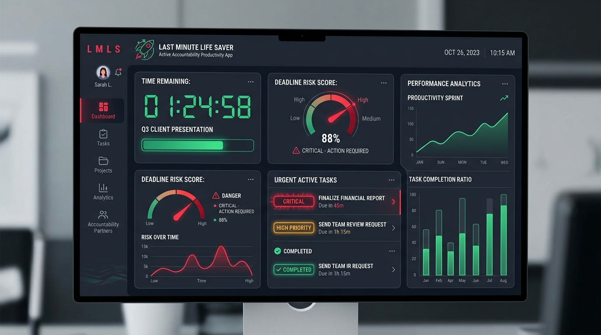
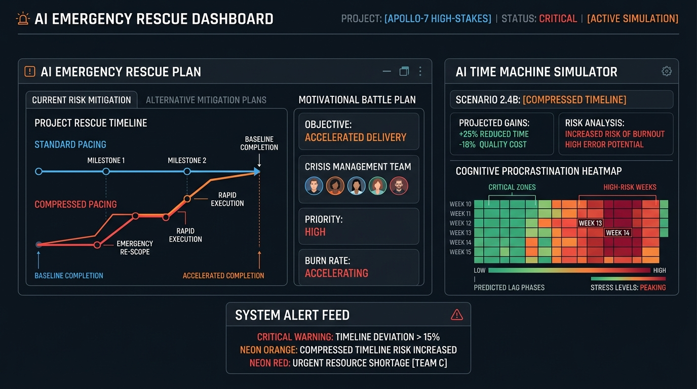
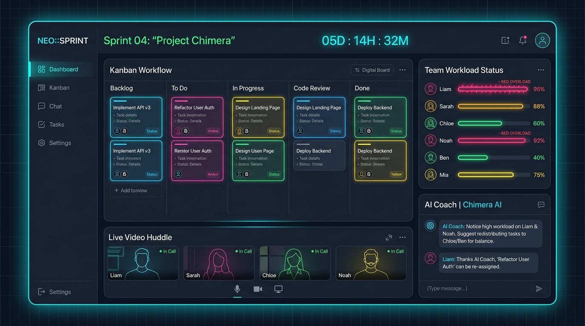

# Last Minute Life Saver User Guide ⏰⚡

> **Active Accountability, Multimodal AI Scheduling, and AI-Guided Group Collaboration.**
> Welcome to the comprehensive manual on how to maximize your productivity, eliminate procrastination, and orchestrate high-performance sprint groups using **Last Minute Life Saver**.

---

## 🧭 Core Product Philosophy

Unlike passive calendar apps that simply notify you when a task is overdue, **Last Minute Life Saver** acts as an **Active Accountability Partner**. 

It uses advanced cognitive pacing algorithms, **Google Gemini AI**, and real-time synchronization to predict deadline risks before they happen, compress schedules when timelines become critical, and balance team workloads dynamically.

---

## 🎨 Design & Aesthetic Identity

Last Minute Life Saver features a premium, eye-safe **Cosmic Slate Dark Theme** crafted with high-contrast displays:
*   **Deep Charcoal Slate Backgrounds** (`bg-[#0a0a0c]`) paired with subtle glowing glass surfaces.
*   **Vibrant Crimson Red Accents** (`text-red-500` / `bg-red-500`) representing high-hazard deadlines and active critical rescue modes.
*   **Fluid Animations**: Powered by `motion/react` to provide micro-interactions, responsive sidebars, hover feedbacks, and elegant tab transitions.
*   **Bento Grid Layouts**: Maximizes structural density, allowing you to view timelines, checklists, chat sessions, and team analytics in a single unified frame.

---

## 🚀 Key Modules & Interactive Walkthroughs

### 1. The Dynamic Bento Dashboard & 3D Risk Analyzer
The primary cockpit designed for high-density visual monitoring. It calculates a real-time **Productivity & Accountability Score (0–100%)** based on task completion and habit consistency.

#### 💡 Advanced Features:
*   **Circular Hazard Dial**: An animated gauge showing your active deadline risk score.
*   **Countdown Timers**: Hour-by-hour remaining timelines for critical items.
*   **Visual Pacing**: Indicates whether your current velocity is "Safe", "Moderate", "High", or "Critical".

---

### 2. Multimodal Task Capture & Syllabus Reader
Stop typing out schedules manually. Upload course syllabi, invoice bills, interview sheets, or screen captures.

#### 💡 How to Use:
1.  Navigate to the **Tasks & Planner** tab.
2.  Drag and drop or select an image file (e.g., an invoice, class syllabus, or project brief).
3.  Type a short natural language query such as *"Extract tasks and add them to my planner."*
4.  **Google Gemini** reads the raw text, identifies deadlines, calculates required efforts, determines priority levels, and automatically inserts the tasks directly into your database.

---

### 3. Emergency Rescue Compression & Time Machine
When remaining task efforts surpass your available hours, standard planning fails. The **Emergency Rescue Engine** steps in to help you survive.

#### 💡 Advanced Features:
*   **AI Time Machine**: Simulates your pacing and outputs predictive projections such as: *"Continuing at this rate means missing your milestone by 2.4 days."*
*   **Schedule Compression**: Dynamically re-allocates non-essential habits and routines to open up dedicated blocks for critical task recovery.
*   **Cognitive Procrastination Probe**: If you try to delay a task, the coach probes your cognitive friction, logs procrastination scores, and gives you tailored psychology-backed advice to start immediately.

---

### 4. Synthetic Vocal Coaching
Receive verbal encouragement and direct advice from our built-in vocal companion.

#### 💡 How to Use:
1.  Navigate to the **AI Vocal Coach** tab.
2.  Press the microphone icon or choose an automated prompt (e.g., *"Assess my day"* or *"Generate emergency plan"*).
3.  The app uses native **Web Speech Synthesis** to deliver custom spoken advice while rendering a real-time bouncing voice frequency wave simulator.

---

### 5. Shared AI Collaboration Workspace
Scale productivity from single-user focus into multi-member group workspaces. Ideal for **Hackathon Teams, Startup Sprints, Student Groups, and Organizations**.

#### 💡 Advanced Features:
*   **Digital Kanban & Sprint Boards**: Staggered cards sorted by backlog, todo, in-progress, review, and completed status.
*   **Simulated Real-Time Group Chat**: Interactive messaging with automated teammates who actively respond to your proposals.
*   **Video/Audio Call Simulation**: WebRTC-style calling frame with screen-sharing, microphone, camera, and recording states.
*   **Meeting Notes Summarizer**: Paste your audio transcript, and Gemini will automatically summarize discussions, extract action items, and **instantly convert them into Kanban cards**!
*   **Automated Standup Bot**: Log your yesterday, today, and blocker points, and receive a formatted Scrum report with a customized **Scrum Master Assessment**.
*   **AI Coach & Smart Balancer**: Evaluates team workloads. Click **Smart Team Balancer** to automatically redistribute sprint tasks from overloaded members (e.g. above 80% workload) to available teammates.

---

## ⚡ How to Use the Application in a Better Way

To unlock the full potential of **Last Minute Life Saver**, implement these professional strategies:

### 1. Harness Chat Commands with the `@AI Manager`
In the **AI Collaboration Workspace** chat, tag the manager with `@AI` to trigger real-time workspace calculations.
*   **Summarize Blockers**: `@AI summarize our active blockers and recommend a path forward.`
*   **Redistribute Workloads**: `@AI check who has the lowest workload and recommend who should take the critical UI task.`
*   **Brainstorm Sprints**: `@AI suggest 3 core subtasks for our landing page launch.`

### 2. Configure MongoDB Cloud Synchronizations
Bridge local browser caches with enterprise-ready cloud durable storage.
1.  Open the **Secrets/Settings panel** in Google AI Studio.
2.  Create an environment variable named `MONGODB_URI` containing your MongoDB Atlas connection string.
3.  Ensure your **IP Access List** in Atlas whitelists the outbound IP listed in the **System Diagnostics** tab.
4.  All habits, profiles, tasks, and team milestones will automatically persist across refreshes, devices, and user sessions.

### 3. Automate Ticket Creation via Meeting Sync
Instead of typing new tickets after team meetings, paste raw conversation text into the **Meeting Notes Summarizer** inside the Voice & Video tab. The AI will extract action items and assign them directly to the correct team members on the Kanban board based on their listed skills.

### 4. Leverage Habit consistency for Accountability
Input daily repeating routines in the **Habit Tracker**. Consistently checking them off increases your **Team Health Score** and lowers the calculated delay risks of major sprint goals.

---

## 🧪 System Health & Integrity Diagnostics

To verify system integrity, navigate to the **System Diagnostics & Testing** tab.
You can run automated test cases to check:
1.  **Authentication & Session Integrity** (validates user models).
2.  **Dynamic Prioritization Math** (validates risk coefficients).
3.  **MongoDB Serialization Adapter** (verifies connection status).
4.  **Streak Calendars** (verifies streak consistency rules).

*Run the test suite anytime to guarantee zero runtime failures!*

---
⏰ **Last Minute Life Saver** — *Stay accountable, stay ahead of the clock, and cross the finish line with confidence!*
